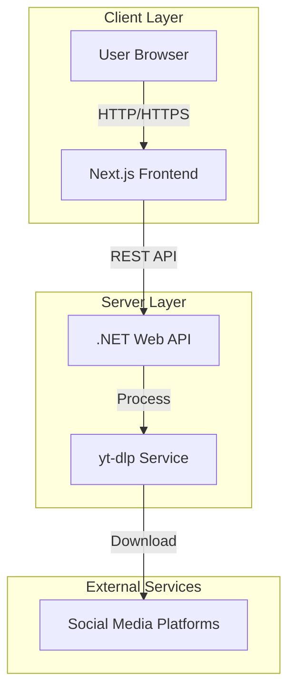
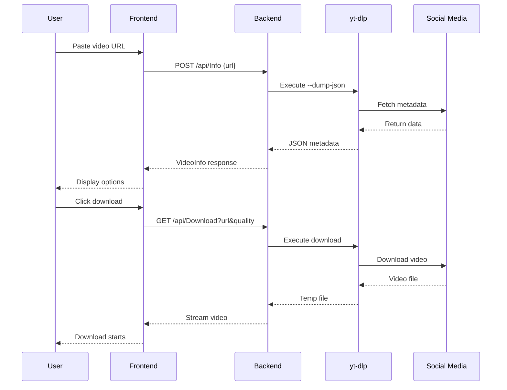
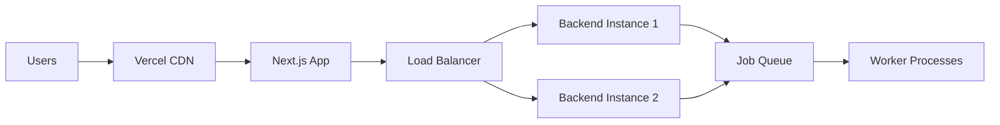

# Architecture Documentation

## System Overview

Video Downloader is a full-stack web application that allows users to download videos from social media platforms (TikTok, Facebook, Shopee Video) with multiple quality options.

## Architecture Diagram



## Technology Stack

### Frontend
- **Framework:** Next.js 15 (React 19)
- **Language:** TypeScript
- **Styling:** CSS Modules
- **State Management:** React Hooks (useState)
- **HTTP Client:** Fetch API

### Backend
- **Framework:** ASP.NET Core 10
- **Language:** C# 12
- **Video Extraction:** yt-dlp
- **CORS:** Enabled for frontend origin

## System Components

### 1. Frontend Application (`client/`)

#### Components Structure
```
src/
├── app/
│   ├── components/
│   │   ├── UrlInput.tsx          # URL input form
│   │   ├── DownloadOptions.tsx   # Download options display
│   │   └── StatusFeedback.tsx    # Loading/error messages
│   ├── page.tsx                  # Main page
│   ├── globals.css               # Global styles
│   └── types.ts                  # TypeScript interfaces
```

#### Key Features
- Responsive mobile-first design
- Real-time loading states
- Error handling with user feedback
- Environment-based API configuration

### 2. Backend API (`server/`)

#### Project Structure
```
server/
├── Controllers/
│   ├── InfoController.cs         # Video info endpoint
│   └── DownloadController.cs     # Download endpoint
├── Services/
│   ├── IYtDlpService.cs         # yt-dlp service interface
│   ├── YtDlpService.cs          # yt-dlp implementation
│   ├── IInfoService.cs          # Info service interface
│   └── InfoService.cs           # Info implementation
├── Models/
│   └── VideoInfo.cs             # Data models
└── Program.cs                   # App configuration
```

#### Key Features
- RESTful API design
- Dependency injection
- Swagger/OpenAPI documentation
- Structured logging
- CORS support

### 3. Video Processing



## Data Flow

### 1. Video Information Retrieval

```
User Input → Frontend Validation → Backend API → yt-dlp → 
Parse Metadata → Extract Formats → Return VideoInfo → Display Options
```

### 2. Video Download

```
User Click → Frontend Request → Backend API → yt-dlp Download → 
Save Temp File → Stream to Client → Cleanup Temp File
```

## Security Considerations

### Frontend
- Environment variables for sensitive configuration
- Input validation before API calls
- HTTPS enforcement
- No sensitive data in client code

### Backend
- CORS policy restrictions
- Input sanitization
- Temporary file cleanup
- HTTPS enforcement
- API rate limiting (recommended)

## Scalability Considerations

### Current Limitations
- Single server instance
- Synchronous video downloads
- Memory-based file streaming

### Recommended Improvements
- Background job queue for downloads
- CDN for static assets
- Load balancer for multiple instances
- Object storage for temporary files
- Caching layer for popular videos

## Deployment Architecture



### Production Setup
- **Frontend:** Vercel (Edge Network)
- **Backend:** Azure App Service / Railway / Render
- **File Storage:** Azure Blob Storage (recommended)
- **Monitoring:** Application Insights / Sentry

## Performance Metrics

### Expected Response Times
- **Info Endpoint:** 2-5 seconds
- **Download Start:** 1-3 seconds
- **Download Speed:** Limited by user bandwidth

### Resource Usage
- **Memory:** ~100MB per concurrent download
- **CPU:** Moderate (video processing)
- **Disk:** Temporary files (~50-200MB per video)

## Error Handling

### Frontend Errors
- Network failures
- Invalid URLs
- Timeout errors
- 400/500 responses

### Backend Errors
- yt-dlp execution failures
- Unsupported platforms
- File system errors
- Network errors

## Monitoring & Logging

### Frontend
- Console errors
- User actions tracking
- Performance metrics

### Backend
- Structured logging (ILogger)
- Request/response logging
- Error tracking
- Performance monitoring

## Future Enhancements

1. **Authentication & User Accounts**
   - Save download history
   - Favorite videos
   - Custom presets

2. **Advanced Features**
   - Batch downloads
   - Playlist support
   - Audio extraction
   - Subtitle downloads

3. **Performance**
   - Background processing
   - Download queue
   - Caching layer

4. **Platform Support**
   - YouTube
   - Instagram
   - Twitter/X
   - More platforms
